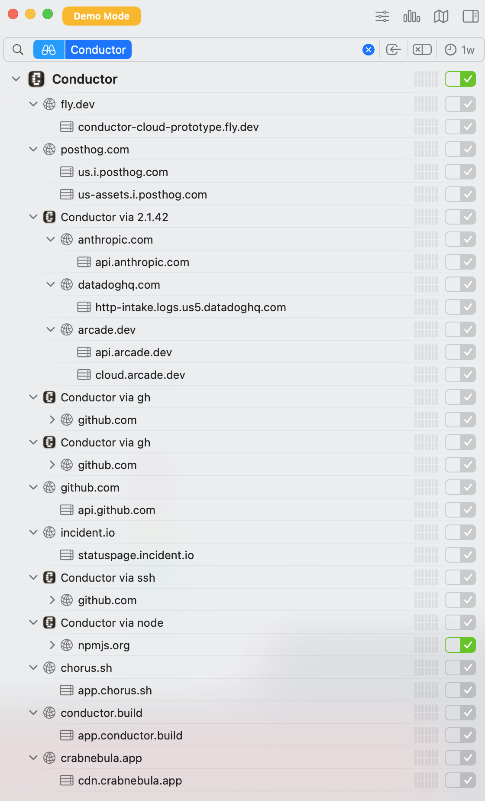

# Network Trace Analysis

A network capture and analysis of [Conductor](https://conductor.build) and [Claude Code](https://claude.ai/claude-code) working together to produce [this diff](https://github.com/ArcadeAI/docs/compare/evantahler/landing-ascii-logo?expand=1) on the ArcadeAI docs repo. The pcap was captured via [Little Snitch](https://www.obdev.at/products/littlesnitch/) during a ~2.6 minute session.



The screenshot above shows Little Snitch's view of the Conductor app's network activity during the capture — connections to fly.dev, PostHog, Anthropic, Datadog, Arcade, GitHub (via `gh` and `ssh`), npmjs.org, incident.io, chorus.sh, conductor.build, and crabnebula.app.

## Analyzer

`analyze.py` is a Python script that parses Little Snitch pcap files and prints a color-coded terminal report with service identification, connection mapping, security flags, and traffic timeline.

## Setup

```bash
uv init
uv add dpkt
```

## Usage

```bash
uv run python analyze.py data/conductor.pcap
```

## Report Sections

1. **Capture Summary** — time range, total packets/bytes, duration, rate
2. **Protocol Breakdown** — TCP/UDP/ICMP/other counts, bytes, percentages
3. **Top Talkers** — top 15 remote IPs by bytes, with service identification
4. **Service Breakdown** — traffic aggregated by identified service (GitHub, Cloudflare, etc.)
5. **DNS Analysis** — queries + response mappings (when DNS traffic is present in capture)
6. **Connection Map** — top 30 flows by bytes, enriched with hostnames and TCP flags
7. **Security Flags** — plaintext HTTP, non-standard ports, connection resets
8. **Traffic Timeline** — ASCII bar chart of traffic volume over time

## Notes

- Handles Little Snitch's non-standard pcap format (all packets written with IPv4 ethertype regardless of actual protocol)
- Identifies services by known IP ranges (GitHub, Cloudflare, AWS, Google Cloud, Vercel, Fly.io, etc.) and reverse DNS
- Local addresses (`0.1.x.x`, `::0.1.x.x`) are Little Snitch synthetic source IPs
- DNS traffic is typically not captured by Little Snitch, so the DNS section may be empty

## IP Identification

Since Little Snitch doesn't include DNS in its pcap exports, IP addresses must be identified by other means. We cross-referenced the pcap analysis with the Little Snitch UI (screenshot above) to build this mapping:

| IP / Range | Identified As | Method |
|---|---|---|
| `2607:6bc0::10`, `160.79.104.10` | **conductor.build** (app.conductor.build) | Little Snitch UI |
| `140.82.116.x` | **GitHub** (HTTPS + SSH via `gh`) | rDNS (`lb-140-82-116-*-sea.github.com`) |
| `2606:4700::*`, `172.66.*` | **Cloudflare CDN** (fronting arcade.dev, posthog, incident.io, chorus.sh) | IP range |
| `2600:1901:0:3084::`, `34.149.*` | **GCP** (likely api.anthropic.com) | IP range + Little Snitch UI |
| `2600:1f18:*` | **AWS** (likely datadoghq.com log intake) | IP range + Little Snitch UI |
| `2a09:8280:1::*` | **Fly.io** (conductor-cloud-prototype.fly.dev) | rDNS + Little Snitch UI |
| `76.76.21.22` | **Vercel** | IP range |
| `66.33.60.35` | **crabnebula.app** (cdn.crabnebula.app) | Little Snitch UI |

The Cloudflare CDN IPs can't be further disambiguated without TLS SNI inspection — they could be any of: arcade.dev, posthog.com, incident.io, chorus.sh, or other Cloudflare-fronted services visible in the Little Snitch UI.

## Example Output

Analysis of `conductor.pcap` — a 2.6 minute Little Snitch capture:

```
  ╔══════════════════════════════════════════════════════╗
  ║   Network Trace Analysis                             ║
  ║   File: data/conductor.pcap                            ║
  ╚══════════════════════════════════════════════════════╝

━━━━━━━━━━━━━━━━━━━━━━━━━━━━━━━━━━━━━━━━━━━━━━━━━━━━━━━━━━━━━━━━━━━━━━━━
┃ 1. Capture Summary
━━━━━━━━━━━━━━━━━━━━━━━━━━━━━━━━━━━━━━━━━━━━━━━━━━━━━━━━━━━━━━━━━━━━━━━━
  Start:    2026-02-16 18:42:45 UTC
  End:      2026-02-16 18:45:23 UTC
  Duration: 158.2s (2.6 min)
  Packets:  15,315
  Bytes:    12.5 MB
  Rate:     96.8 pkt/s, 80.7 KB/s

━━━━━━━━━━━━━━━━━━━━━━━━━━━━━━━━━━━━━━━━━━━━━━━━━━━━━━━━━━━━━━━━━━━━━━━━
┃ 2. Protocol Breakdown
━━━━━━━━━━━━━━━━━━━━━━━━━━━━━━━━━━━━━━━━━━━━━━━━━━━━━━━━━━━━━━━━━━━━━━━━
  Protocol  Packets   Pkt %    Bytes  Byte %
  ────────  ───────  ──────  ───────  ──────
  TCP        15,315  100.0%  12.5 MB  100.0%

━━━━━━━━━━━━━━━━━━━━━━━━━━━━━━━━━━━━━━━━━━━━━━━━━━━━━━━━━━━━━━━━━━━━━━━━
┃ 3. Top Talkers (Remote Hosts)
━━━━━━━━━━━━━━━━━━━━━━━━━━━━━━━━━━━━━━━━━━━━━━━━━━━━━━━━━━━━━━━━━━━━━━━━
  By total bytes (src + dst):

  IP Address                                   Sent  Received     Total  Hostname
  ───────────────────────────────────────  ────────  ────────  ────────  ──────────────────────────────────
  2607:6bc0::10                              1.6 MB    8.1 MB    9.7 MB  conductor.build
  160.79.104.10                            714.2 KB  734.8 KB    1.4 MB  conductor.build
  140.82.116.6                             375.9 KB   55.8 KB  431.6 KB  GitHub
  2606:4700::6810:122                      363.1 KB   16.8 KB  379.9 KB  Cloudflare CDN
  2600:1901:0:3084::                        12.9 KB  122.5 KB  135.4 KB  GCP (likely api.anthropic.com)
  140.82.116.4                              92.3 KB   15.1 KB  107.5 KB  GitHub
  2606:4700:10::ac42:9478                   59.2 KB   21.0 KB   80.1 KB  Cloudflare CDN
  2606:4700:10::6814:11a7                   44.4 KB    3.0 KB   47.4 KB  Cloudflare CDN
  2600:1f18:4c12:9a02:c6c7:fc08:82f6:ce27   12.8 KB   24.4 KB   37.2 KB  AWS (likely datadoghq.com)
  172.66.148.120                            20.1 KB    3.8 KB   23.9 KB  Cloudflare CDN
  76.76.21.22                               18.7 KB    2.4 KB   21.1 KB  Vercel
  2606:4700:10::6814:1bcc                   10.8 KB    8.8 KB   19.6 KB  Cloudflare CDN
  2a09:8280:1::c6:3c04:0                     8.0 KB    6.9 KB   15.0 KB  Fly.io (conductor-cloud-prototype)
  66.33.60.35                                9.4 KB    1.2 KB   10.5 KB  crabnebula.app
  34.149.66.137                              4.9 KB    3.4 KB    8.2 KB  GCP (likely api.anthropic.com)

━━━━━━━━━━━━━━━━━━━━━━━━━━━━━━━━━━━━━━━━━━━━━━━━━━━━━━━━━━━━━━━━━━━━━━━━
┃ 4. Service Breakdown
━━━━━━━━━━━━━━━━━━━━━━━━━━━━━━━━━━━━━━━━━━━━━━━━━━━━━━━━━━━━━━━━━━━━━━━━
  Service                             Flows     Bytes      %
  ──────────────────────────────────  ─────  ────────  ─────
  conductor.build                     1,636   11.1 MB  89.5%
  Cloudflare CDN                         66  570.7 KB   4.5%
  GitHub                                 38  539.1 KB   4.2%
  GCP (likely api.anthropic.com)         12  143.7 KB   1.1%
  AWS (likely datadoghq.com)              2   37.2 KB   0.3%
  Vercel                                  4   21.1 KB   0.2%
  Fly.io (conductor-cloud-prototype)      4   15.0 KB   0.1%
  crabnebula.app                          2   10.5 KB   0.1%
  Unknown                                16    2.5 KB   0.0%

━━━━━━━━━━━━━━━━━━━━━━━━━━━━━━━━━━━━━━━━━━━━━━━━━━━━━━━━━━━━━━━━━━━━━━━━
┃ 5. DNS Analysis
━━━━━━━━━━━━━━━━━━━━━━━━━━━━━━━━━━━━━━━━━━━━━━━━━━━━━━━━━━━━━━━━━━━━━━━━
  Total DNS queries: 0
  Unique names queried: 0
  Names with responses: 0

  Top queried names:

  (no data)

━━━━━━━━━━━━━━━━━━━━━━━━━━━━━━━━━━━━━━━━━━━━━━━━━━━━━━━━━━━━━━━━━━━━━━━━
┃ 6. Connection Map (Top 30 Flows)
━━━━━━━━━━━━━━━━━━━━━━━━━━━━━━━━━━━━━━━━━━━━━━━━━━━━━━━━━━━━━━━━━━━━━━━━
  Source                          Destination                                  Proto   Pkts     Bytes  Flags    Hostname
  ───────────────────────────  ─  ───────────────────────────────────────────  ─────  ─────  ────────  ───────  ──────────────────────────────
  ::0.1.31.140:2960            →  2607:6bc0::10:443                            TCP    1,056    3.4 MB  FIN,SYN  conductor.build
  ::0.1.31.140:2958            →  2607:6bc0::10:443                            TCP      687    2.5 MB  FIN,SYN  conductor.build
  ::0.1.31.140:2956            →  2607:6bc0::10:443                            TCP      165  662.3 KB  FIN,SYN  conductor.build
  ::0.1.31.140:3167            →  2607:6bc0::10:443                            TCP      104  440.1 KB  FIN,SYN  conductor.build
  2607:6bc0::10:443            →  ::0.1.31.140:2960                            TCP    1,054  223.5 KB  FIN,SYN  Local
  ::0.1.36.38:3416             →  2607:6bc0::10:443                            TCP       35  199.8 KB  FIN,SYN  conductor.build
  140.82.116.6:443             →  0.1.29.67:2756                               TCP       25  146.4 KB  FIN,SYN  Local
  2606:4700::6810:122:443      →  ::0.1.40.14:3832                             TCP       33  146.0 KB  FIN,SYN  Local
  140.82.116.6:443             →  0.1.29.67:3924                               TCP       20  145.4 KB  FIN,SYN  Local
  2607:6bc0::10:443            →  ::0.1.31.140:2958                            TCP      685  128.0 KB  FIN,SYN  Local
  ::0.1.31.140:3222            →  2600:1901:0:3084:::443                       TCP       25  119.0 KB  FIN,SYN  GCP (likely api.anthropic.com)
  ::0.1.31.140:2999            →  2607:6bc0::10:443                            TCP       49   91.8 KB  FIN,SYN  conductor.build
  ::0.1.31.140:2954            →  2607:6bc0::10:443                            TCP       22   87.5 KB  FIN,SYN  conductor.build
  0.1.36.38:3539               →  160.79.104.10:443                            TCP       15   82.0 KB  FIN,SYN  conductor.build
  0.1.36.38:3789               →  160.79.104.10:443                            TCP       16   69.2 KB  FIN,SYN  conductor.build
  0.1.36.38:3419               →  160.79.104.10:443                            TCP       15   65.2 KB  FIN,SYN  conductor.build
  2606:4700::6810:122:443      →  ::0.1.35.57:3368                             TCP       14   54.4 KB  FIN,SYN  Local
  2606:4700::6810:122:443      →  ::0.1.40.64:3833                             TCP       13   54.3 KB  FIN,SYN  Local
  2606:4700::6810:122:443      →  ::0.1.40.110:3834                            TCP       12   54.3 KB  FIN,SYN  Local
  2606:4700::6810:122:443      →  ::0.1.34.162:3289                            TCP       13   54.2 KB  FIN,SYN  Local
  140.82.116.4:22              →  0.1.41.80:3862                               TCP       34   52.0 KB  FIN,SYN  Local
  2607:6bc0::10:443            →  ::0.1.31.140:2956                            TCP      163   49.3 KB  FIN,SYN  Local
  2606:4700:10::6814:11a7:443  →  ::0.1.29.94:2724                             TCP       11   44.4 KB  SYN      Local
  140.82.116.4:22              →  0.1.29.249:2736                              TCP       33   35.6 KB  FIN,SYN  Local
  2607:6bc0::10:443            →  ::0.1.31.140:3167                            TCP      102   31.0 KB  FIN,SYN  Local
  0.1.36.38:3773               →  160.79.104.10:443                            TCP       15   26.7 KB  FIN,SYN  conductor.build
  ::0.1.29.94:2723             →  2600:1f18:4c12:9a02:c6c7:fc08:82f6:ce27:443  TCP       45   24.4 KB  SYN      AWS (likely datadoghq.com)
  2606:4700:10::ac42:9478:443  →  ::0.1.30.14:2752                             TCP        9   19.6 KB  FIN,SYN  Local
  2606:4700:10::ac42:9478:443  →  ::0.1.36.38:3394                             TCP        9   19.5 KB  FIN,SYN  Local
  172.66.148.120:443           →  0.1.31.140:2969                              TCP        9   19.3 KB  FIN,SYN  Local

━━━━━━━━━━━━━━━━━━━━━━━━━━━━━━━━━━━━━━━━━━━━━━━━━━━━━━━━━━━━━━━━━━━━━━━━
┃ 7. Security Flags
━━━━━━━━━━━━━━━━━━━━━━━━━━━━━━━━━━━━━━━━━━━━━━━━━━━━━━━━━━━━━━━━━━━━━━━━
  No significant security flags detected.

━━━━━━━━━━━━━━━━━━━━━━━━━━━━━━━━━━━━━━━━━━━━━━━━━━━━━━━━━━━━━━━━━━━━━━━━
┃ 8. Traffic Timeline
━━━━━━━━━━━━━━━━━━━━━━━━━━━━━━━━━━━━━━━━━━━━━━━━━━━━━━━━━━━━━━━━━━━━━━━━
  Bucket size: 3s

      Time   Packets       Bytes  Bar
  ────────  ────────  ──────────  ──────────────────────────────────────────────────
        0s       143     91.6 KB  ██░░░░░░░░░░░░░░░░░░░░░░░░░░░░░░░░░░░░░░░░░░░░░░░░
        3s         6      2.1 KB  ░░░░░░░░░░░░░░░░░░░░░░░░░░░░░░░░░░░░░░░░░░░░░░░░░░
        6s       363    269.5 KB  ██████░░░░░░░░░░░░░░░░░░░░░░░░░░░░░░░░░░░░░░░░░░░░
        9s     2,186    763.9 KB  ██████████████████░░░░░░░░░░░░░░░░░░░░░░░░░░░░░░░░
       12s     2,293      1.1 MB  █████████████████████████░░░░░░░░░░░░░░░░░░░░░░░░░
       15s        67    116.2 KB  ██░░░░░░░░░░░░░░░░░░░░░░░░░░░░░░░░░░░░░░░░░░░░░░░░
       18s        67    104.8 KB  ██░░░░░░░░░░░░░░░░░░░░░░░░░░░░░░░░░░░░░░░░░░░░░░░░
       21s        78    161.4 KB  ███░░░░░░░░░░░░░░░░░░░░░░░░░░░░░░░░░░░░░░░░░░░░░░░
       24s        90     23.1 KB  ░░░░░░░░░░░░░░░░░░░░░░░░░░░░░░░░░░░░░░░░░░░░░░░░░░
       27s        59    201.7 KB  ████░░░░░░░░░░░░░░░░░░░░░░░░░░░░░░░░░░░░░░░░░░░░░░
       30s        69    113.7 KB  ██░░░░░░░░░░░░░░░░░░░░░░░░░░░░░░░░░░░░░░░░░░░░░░░░
       33s        72    170.8 KB  ████░░░░░░░░░░░░░░░░░░░░░░░░░░░░░░░░░░░░░░░░░░░░░░
       36s       108    298.8 KB  ███████░░░░░░░░░░░░░░░░░░░░░░░░░░░░░░░░░░░░░░░░░░░
       39s        26      5.9 KB  ░░░░░░░░░░░░░░░░░░░░░░░░░░░░░░░░░░░░░░░░░░░░░░░░░░
       42s       106     49.2 KB  █░░░░░░░░░░░░░░░░░░░░░░░░░░░░░░░░░░░░░░░░░░░░░░░░░
       45s        14     18.5 KB  ░░░░░░░░░░░░░░░░░░░░░░░░░░░░░░░░░░░░░░░░░░░░░░░░░░
       48s        40     18.7 KB  ░░░░░░░░░░░░░░░░░░░░░░░░░░░░░░░░░░░░░░░░░░░░░░░░░░
       51s         0       0.0 B  ░░░░░░░░░░░░░░░░░░░░░░░░░░░░░░░░░░░░░░░░░░░░░░░░░░
       54s        68     21.5 KB  ░░░░░░░░░░░░░░░░░░░░░░░░░░░░░░░░░░░░░░░░░░░░░░░░░░
       57s        80    282.7 KB  ██████░░░░░░░░░░░░░░░░░░░░░░░░░░░░░░░░░░░░░░░░░░░░
      1.0m       106     77.4 KB  █░░░░░░░░░░░░░░░░░░░░░░░░░░░░░░░░░░░░░░░░░░░░░░░░░
      1.1m       130    364.4 KB  ████████░░░░░░░░░░░░░░░░░░░░░░░░░░░░░░░░░░░░░░░░░░
      1.1m        62     60.9 KB  █░░░░░░░░░░░░░░░░░░░░░░░░░░░░░░░░░░░░░░░░░░░░░░░░░
      1.1m        30      6.9 KB  ░░░░░░░░░░░░░░░░░░░░░░░░░░░░░░░░░░░░░░░░░░░░░░░░░░
      1.2m        14     54.3 KB  █░░░░░░░░░░░░░░░░░░░░░░░░░░░░░░░░░░░░░░░░░░░░░░░░░
      1.2m       114    288.2 KB  ██████░░░░░░░░░░░░░░░░░░░░░░░░░░░░░░░░░░░░░░░░░░░░
      1.3m        86     56.6 KB  █░░░░░░░░░░░░░░░░░░░░░░░░░░░░░░░░░░░░░░░░░░░░░░░░░
      1.4m       128    345.6 KB  ████████░░░░░░░░░░░░░░░░░░░░░░░░░░░░░░░░░░░░░░░░░░
      1.4m        66     62.7 KB  █░░░░░░░░░░░░░░░░░░░░░░░░░░░░░░░░░░░░░░░░░░░░░░░░░
      1.4m       118    293.3 KB  ██████░░░░░░░░░░░░░░░░░░░░░░░░░░░░░░░░░░░░░░░░░░░░
      1.5m       108     51.8 KB  █░░░░░░░░░░░░░░░░░░░░░░░░░░░░░░░░░░░░░░░░░░░░░░░░░
      1.6m        96     15.7 KB  ░░░░░░░░░░░░░░░░░░░░░░░░░░░░░░░░░░░░░░░░░░░░░░░░░░
      1.6m       148     47.2 KB  █░░░░░░░░░░░░░░░░░░░░░░░░░░░░░░░░░░░░░░░░░░░░░░░░░
      1.6m     4,815      2.1 MB  ██████████████████████████████████████████████████
      1.7m       227     27.0 KB  ░░░░░░░░░░░░░░░░░░░░░░░░░░░░░░░░░░░░░░░░░░░░░░░░░░
      1.8m         0       0.0 B  ░░░░░░░░░░░░░░░░░░░░░░░░░░░░░░░░░░░░░░░░░░░░░░░░░░
      1.8m         6      2.8 KB  ░░░░░░░░░░░░░░░░░░░░░░░░░░░░░░░░░░░░░░░░░░░░░░░░░░
      1.9m       138    400.2 KB  █████████░░░░░░░░░░░░░░░░░░░░░░░░░░░░░░░░░░░░░░░░░
      1.9m       228    381.8 KB  █████████░░░░░░░░░░░░░░░░░░░░░░░░░░░░░░░░░░░░░░░░░
      1.9m       184    427.8 KB  ██████████░░░░░░░░░░░░░░░░░░░░░░░░░░░░░░░░░░░░░░░░
      2.0m       242    394.5 KB  █████████░░░░░░░░░░░░░░░░░░░░░░░░░░░░░░░░░░░░░░░░░
      2.0m       464    857.4 KB  ████████████████████░░░░░░░░░░░░░░░░░░░░░░░░░░░░░░
      2.1m        82    134.9 KB  ███░░░░░░░░░░░░░░░░░░░░░░░░░░░░░░░░░░░░░░░░░░░░░░░
      2.1m       161    302.5 KB  ███████░░░░░░░░░░░░░░░░░░░░░░░░░░░░░░░░░░░░░░░░░░░
      2.2m       238    469.0 KB  ███████████░░░░░░░░░░░░░░░░░░░░░░░░░░░░░░░░░░░░░░░
      2.2m       257    443.7 KB  ██████████░░░░░░░░░░░░░░░░░░░░░░░░░░░░░░░░░░░░░░░░
      2.3m       144    440.4 KB  ██████████░░░░░░░░░░░░░░░░░░░░░░░░░░░░░░░░░░░░░░░░
      2.4m       103     45.9 KB  █░░░░░░░░░░░░░░░░░░░░░░░░░░░░░░░░░░░░░░░░░░░░░░░░░
      2.4m       237    398.0 KB  █████████░░░░░░░░░░░░░░░░░░░░░░░░░░░░░░░░░░░░░░░░░
      2.5m        83    108.1 KB  ██░░░░░░░░░░░░░░░░░░░░░░░░░░░░░░░░░░░░░░░░░░░░░░░░
      2.5m       170    194.1 KB  ████░░░░░░░░░░░░░░░░░░░░░░░░░░░░░░░░░░░░░░░░░░░░░░
      2.5m        10      9.6 KB  ░░░░░░░░░░░░░░░░░░░░░░░░░░░░░░░░░░░░░░░░░░░░░░░░░░
      2.6m       385     76.8 KB  █░░░░░░░░░░░░░░░░░░░░░░░░░░░░░░░░░░░░░░░░░░░░░░░░░
```

